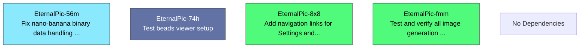

# Beads Export

*Generated: Sat, 03 Jan 2026 17:36:41 +07*

## Summary

| Metric | Count |
|--------|-------|
| **Total** | 4 |
| Open | 2 |
| In Progress | 1 |
| Blocked | 0 |
| Closed | 1 |

## Quick Actions

Ready-to-run commands for bulk operations:

```bash
# Close all in-progress items
bd close EternalPic-56m

# Close all open items
bd close EternalPic-fmm EternalPic-8x8

# View high-priority items (P0/P1)
bd show EternalPic-56m

```

## Table of Contents

- [🔵 EternalPic-56m Fix nano-banana binary data handling in trending image generation](#eternalpic-56m)
- [🟢 EternalPic-fmm Test and verify all image generation features](#eternalpic-fmm)
- [🟢 EternalPic-8x8 Add navigation links for Settings and Docs pages](#eternalpic-8x8)
- [⚫ EternalPic-74h Test beads viewer setup](#eternalpic-74h)

---

## Dependency Graph



---

## 🐛 EternalPic-56m Fix nano-banana binary data handling in trending image generation

| Property | Value |
|----------|-------|
| **Type** | 🐛 bug |
| **Priority** | ⚡ High (P1) |
| **Status** | 🔵 in_progress |
| **Created** | 2026-01-03 17:32 |
| **Updated** | 2026-01-03 17:33 |

<details>
<summary>📋 Commands</summary>

```bash
# Mark as complete
bd close EternalPic-56m

# Add a comment
bd comment EternalPic-56m 'Your comment here'

# Change priority (0=Critical, 1=High, 2=Medium, 3=Low)
bd update EternalPic-56m -p 1

# View full details
bd show EternalPic-56m
```

</details>

---

## 📋 EternalPic-fmm Test and verify all image generation features

| Property | Value |
|----------|-------|
| **Type** | 📋 task |
| **Priority** | 🔹 Medium (P2) |
| **Status** | 🟢 open |
| **Created** | 2026-01-03 17:33 |
| **Updated** | 2026-01-03 17:33 |

<details>
<summary>📋 Commands</summary>

```bash
# Start working on this issue
bd update EternalPic-fmm -s in_progress

# Add a comment
bd comment EternalPic-fmm 'Your comment here'

# Change priority (0=Critical, 1=High, 2=Medium, 3=Low)
bd update EternalPic-fmm -p 1

# View full details
bd show EternalPic-fmm
```

</details>

---

## 📋 EternalPic-8x8 Add navigation links for Settings and Docs pages

| Property | Value |
|----------|-------|
| **Type** | 📋 task |
| **Priority** | 🔹 Medium (P2) |
| **Status** | 🟢 open |
| **Created** | 2026-01-03 17:33 |
| **Updated** | 2026-01-03 17:33 |

<details>
<summary>📋 Commands</summary>

```bash
# Start working on this issue
bd update EternalPic-8x8 -s in_progress

# Add a comment
bd comment EternalPic-8x8 'Your comment here'

# Change priority (0=Critical, 1=High, 2=Medium, 3=Low)
bd update EternalPic-8x8 -p 1

# View full details
bd show EternalPic-8x8
```

</details>

---

## 📋 EternalPic-74h Test beads viewer setup

| Property | Value |
|----------|-------|
| **Type** | 📋 task |
| **Priority** | ⚡ High (P1) |
| **Status** | ⚫ closed |
| **Created** | 2026-01-03 17:31 |
| **Updated** | 2026-01-03 17:34 |
| **Closed** | 2026-01-03 17:34 |

---

